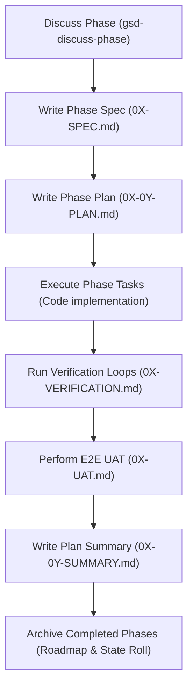

# Workspace Customization Rules: LoexAI B2B SaaS

These are project-scoped guidelines that the agent MUST follow at all times.

---

## 1. Strict Get Shit Done (GSD) Workflow Architecture

Every action, file edit, and phase transition in the workspace must adhere to the GSD lifecycle. 

### GSD Lifecycle Workflow:


### GSD Milestone Folder Architecture:
```
C:/Users/duyma/Desktop/loexYeni/.planning/
├── PROJECT.md                    # Core project vision, scope, requirements trace
├── REQUIREMENTS.md               # Requirements locked for the CURRENT active milestone
├── ROADMAP.md                    # Phase definitions & checkboxes for the CURRENT active milestone
├── STATE.md                      # Focus phase, current plan, velocity progress indicators
├── MILESTONES.md                 # Log of completed milestones in reverse chronological order
└── milestones/                   # Milestone archive directory
    ├── v1.0-REQUIREMENTS.md      # Archived locked requirements for v1.0
    ├── v1.0-ROADMAP.md           # Archived checked-off roadmap for v1.0
    ├── v1.0/                     # Archived milestone folder
    │   ├── v1.0-MILESTONE-AUDIT.md # Final E2E audit validation report
    │   └── phases/               # Archived phases folder for v1.0
    │       ├── 01-setup/
    │       └── ...
    └── v2.0/                     # ACTIVE milestone folder
        └── phases/               # Active phases folder for v2.0
            ├── 01-name/      # Completed Phase 1 files
            ├── 02-name/          # Completed Phase 2 files
            ├── 03-name/  # Completed Phase 3 files
            ├── 04-name/     # Active execution Phase 4 files
            └── 05-name/         # Upcoming Phase 5 files
```

### Folder Structure Constraints:
* All active phase planning documents must be created under the current milestone folder:
  `C:/Users/duyma/Desktop/loexYeni/.planning/milestones/<milestone-version>/phases/<phase-num>-<phase-name>/`
* Active phases folders must never be placed at the root `.planning/phases/` folder. They must remain structured inside their active milestone folder.

### GSD Milestone Lifecycle & Transitions:
1. **Milestone Initialization**:
   - Create a new folder under `.planning/milestones/<version>/` containing a `phases/` subdirectory.
   - Update `PROJECT.md` with the new milestone scope, constraints, and requirements.
   - Initialize/Reset `REQUIREMENTS.md`, `ROADMAP.md`, and `STATE.md` in the `.planning/` root to reflect the new active milestone.
2. **Active Execution**:
   - Create phase folders (e.g. `04-dashboard/`) under `.planning/milestones/<version>/phases/` containing `SPEC.md`, `PLAN.md`, `UAT.md`, `VERIFICATION.md`, and `SUMMARY.md`.
   - Complete plans sequentially, updating `ROADMAP.md` and `STATE.md` at each transition.
3. **Milestone Closure & Archiving**:
   - Once all roadmap phases are checked off, run the milestone audit (`/gsd-audit-milestone`).
   - Write the E2E verification audit report to `.planning/milestones/<version>/<version>-MILESTONE-AUDIT.md`.
   - Copy the active `ROADMAP.md` and `REQUIREMENTS.md` from the `.planning/` root to the `.planning/milestones/` archive directory, naming them `<version>-ROADMAP.md` and `<version>-REQUIREMENTS.md` respectively.
   - Reset the root files for the next milestone.

---

## 2. Mandatory Refero-First UI/UX Design Process

Every user interface, visual layout, component styling, typography, color palettes, and motion styling decision must be grounded in Refero references.

### Requirements:
1. **Search Before Styling**: Before writing any CSS, HTML layout grid structure, or React components:
   * Perform queries via Refero MCP styles search (`refero_search_styles`) to lock visual brand styles (e.g. typography, borders, canvas overlay grids).
   * Perform queries via Refero MCP screen search (`refero_search_screens`) to study structural B2B SaaS layout elements (e.g., pricing toggles, dashboard list grids, accordion headers).
2. **Ground Design Choices**: All visual choices must be explicitly documented in the phase `SPEC.md` or `UI-SPEC.md` files, referencing specific screenshot preview/thumbnail URLs from Refero.
3. **Avoid AI Slop**: Do not generate standard generic/average visual elements. Interface design must feel premium, using HSL-tailored colors, slate dark modes, glowing border treatments, and smooth transitions.


https://github.com/gsd-build/get-shit-done
https://github.com/referodesign/refero_skill
https://github.com/multica-ai/andrej-karpathy-skills